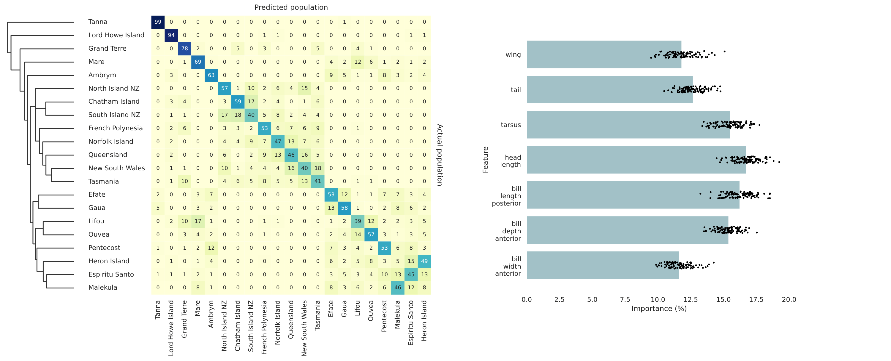

<!-- add a table of contents here -->
## Table of Contents

- [About](#about)
- [This Repository](#this-repository)
- [Getting Started](#getting-started)
  - [Installation](#installation)
  - [Dependencies](#dependencies)
- [Running the analyses](#running-the-analyses)
- [Bugs and Issues](#bugs-and-issues)


## This Repository

This repository includes code to train a simple RF classifier to predict the
origin of silvereyes (*Zosterops lateralis*) based on their morphology. The

### Project Organization

```text
.
├── data                                   # Data used in the project
│   └── raw                                # Original, unmodified data
│       └── morph-df.csv                   # CSV file with raw data
├── environment.yml                        # Conda environment file
├── figures                                # Output figures from the analysis
│   ├── confusion-matrix-clustermap.pdf    # Clustermap of the confusion matrix
│   ├── confusion-matrix.pdf               # Confusion matrix
│   ├── feature-importances.pdf            # Plot of feature importances
│   └── permutation-test-score.pdf         # Permutation test score plot
├── README.md                              # The file you're reading now
├── scripts                                # Scripts to reproduce the analysis
│   └── train-rf.py                        # Script to train the random forest model
└── src                                    # Source code for the project

```

## Getting Started

This project uses a specific Conda environment. To reproduce this environment on your machine, follow these steps:

1. Make sure you have [Anaconda](https://www.anaconda.com/products/distribution) or [Miniconda](https://docs.conda.io/en/latest/miniconda.html) installed.

2. Clone this repository to your local machine:

```bash
git clone https://github.com/nilomr/silvereye-morphology.git
```

3. Navigate to the repository's directory.

4. Run the following command to create the Conda environment from the `environment.yml` file:

```bash
conda env create -f environment.yml
```

5. Activate the environment:

```bash
conda activate silvereye-morphology
```


## Running the analysis

The `train-rf.py` script is used to train the random forest model. Here's how to run it:

Make sure your Conda environment is activated, then navigate to the `scripts`
directory, and run the following command:

```bash
python train-rf.py

```
The script will output a heatmap plot as a PDF file.

<br>

## Bugs and Issues

If you encounter any bugs or issues, please let me know by [creating an
issue](https://github.com/nilomr/silvereye-morphology/issues/new/choose) in this
repository.


#
<sub>
<br>© Nilo M. Recalde, 2023
</sub>


